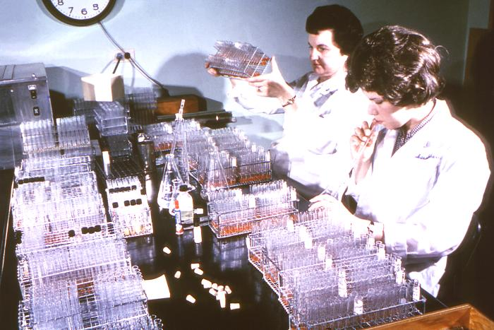
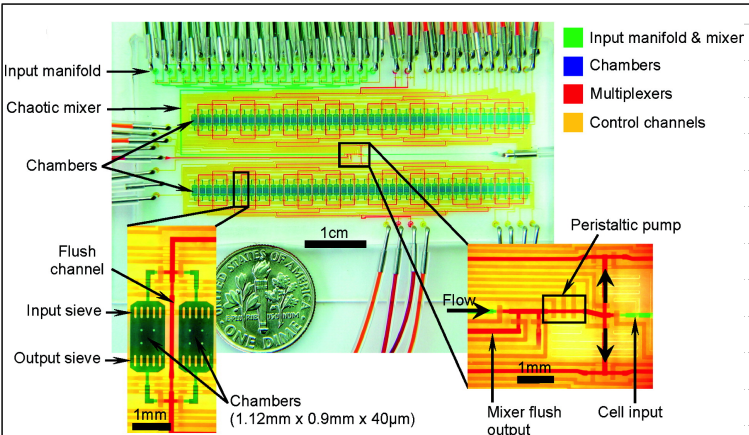
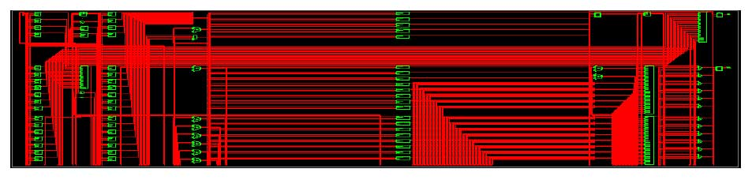
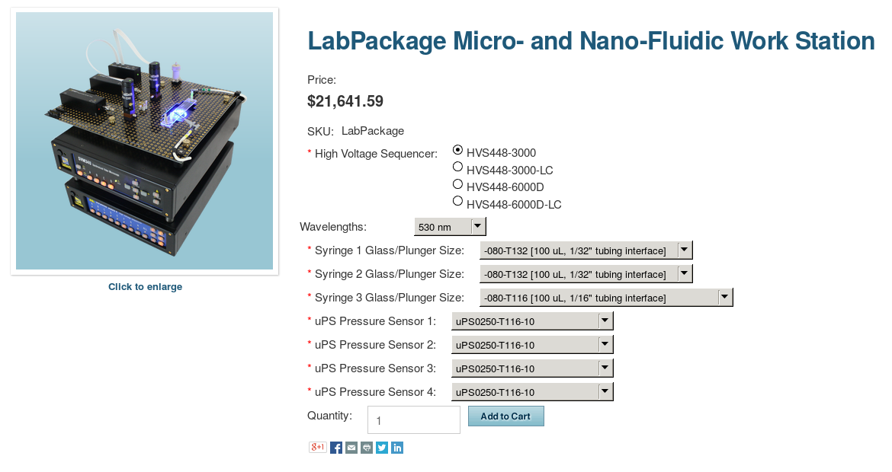
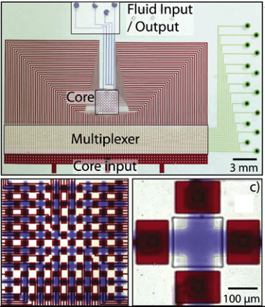
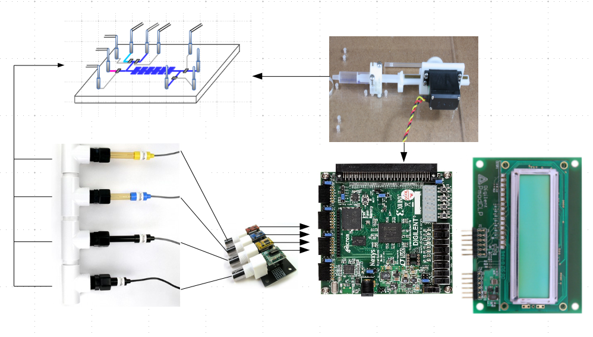
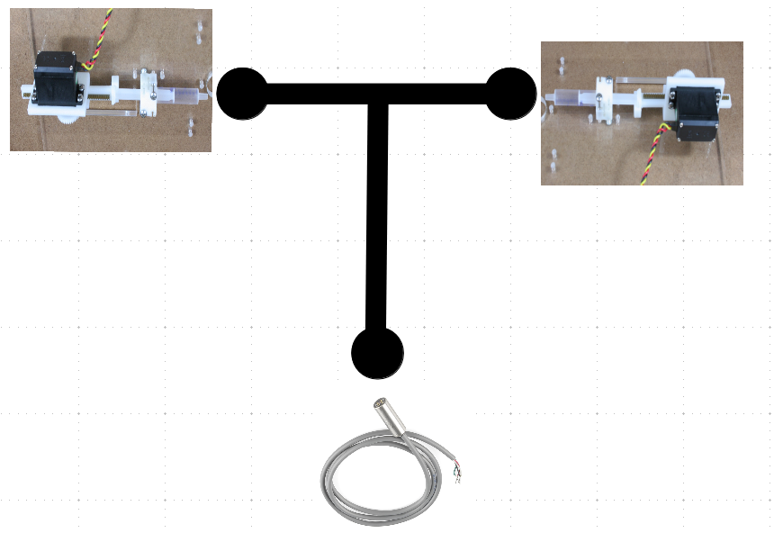
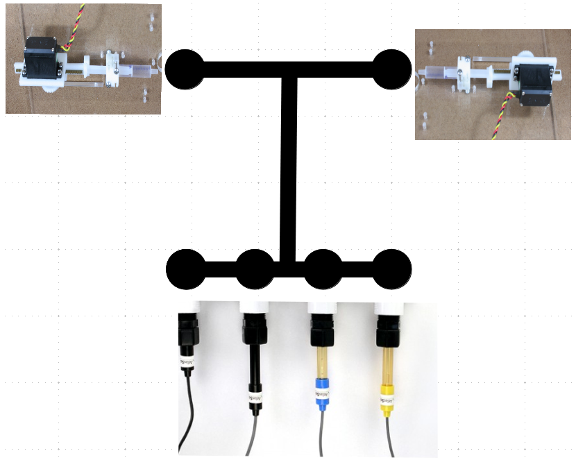

## FPGA Microfluidic Design Suite  
### **Ryan Silva & Yunpeng Wang**
### a.k.a. Tha MicroFluigis

[Discover Magazine](http://blogs.discovermagazine.com/bodyhorrors/2013/03/20/mouth_pipetting/)

### Goal of the project:
- Apply the computational power of an FPGA to the microfluidic domain 
- Specifically create $\mu$F support hardware for an open-source platform

### Why should you care?
- [Currently very expensive](http://products.labsmith.com/labpackage-micro-and-nano-fluidic-work-station/#.VOSsrjUrr7A)

### Why should you care?
- No real-time batch processing

### Proposed library of support hardware:
  - Sensing:
    - pH Probe
    - Color Sensor
    - Dissolved Oxygen Sensor
  - Controlling:
    - Valves
    - Flow

### High-Level Diagram

### Initial Experiment

### Final Demo

### H/W Needs (Total Price = $152.55)

| Item | Price | Quantity | Total |
| :-: | :-: | :-: | :-: |
| Nexys 3 FPGA Board | - | 1 | $0 |
| [PmodCLS LCD](http://www.digilentinc.com/Products/Detail.cfm?NavPath=2,401,473&Prod=PMOD-CLS) | $39 | 1 | $39 |
| Atlas Scientific pH Probe | - | 2 | $0 |
| Atlas Scientific EZO pH Stamp | - | 2 | $0 |
| Atlas Scientific DOX Probe | - | 1 | $0 |
| Atlas Scientific DOX Stamp | - | 1 | $0 |
| Atlas Scientific RGB Sensor | - | 1 | $0 |
| [Hitec HS-645MG Servo](http://www.amazon.com/Hitec-32645S-HS-645MG-Torque-Metal/dp/B003T6RSVQ/ref=sr_1_1?ie=UTF8&qid=1424281100&sr=8-1&keywords=hs-645mg) | $29.14 | 2 | $58.28 |
| RSA48-2HS-48 48 Tooth 48 Pitch Servo Mount Gear | $4.88 | 2 | $9.76 |
| [McMaster 7854K12 2' brass gear rack 48p 20d PA 1/8" face](http://www.mcmaster.com/#catalog/121/1106/=vyqxny) | $31.98 | 1 | $31.98 |
| [McMaster 91772A144 1/4" 6-32 Machine Screws](http://www.mcmaster.com/#catalog/121/3001/=vyr01f) | $4.55 | 1 | $4.55 |
| [McMaster 91772A148 1/2" 6-32 Machine Screws](http://www.mcmaster.com/#catalog/121/3001/=vyr1d3) | $4.49 | 1 | $4.49 |
| [McMaster 91772A146 3/8" 6-32 Machine Screws](http://www.mcmaster.com/#catalog/121/3001/=vyr1kl) | $4.49 | 1 | $4.49 |
| Norm-Ject Luer Lock Syringe (3ml) | - | - | - |

### Biggest Worries
- Syringe pump!
  - Acquisition of equipment
  - Fabrication issues
  - Voltage mismatch on the servo
- Fabrication of microfluidic chips

### Fallback Plan
- If no $\mu$F chips
  - Use test tubes for demo
- If no syringe pump
  - Weep
  - Gold plate parallel sensor interface

### Timeline
- February
  - Acquire equipment
  - 3D Print Parts
  - Create modular interfaces
- March
  - Assemble and characterize syringe pump
  - Integrate sensor interfaces
- April
  - Integrate syringe pump and sensor interface
  - Fabricate microfluidic chip
  - Characterize system
- May 
  - Demo!
