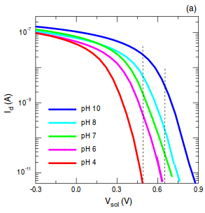

## Connecting Ideas:
### Synthetic Biology to Electronics
#### *Tentative Plan*
#### *August - December 2014*
### __Ryan Silva__

## Why?
- Biological sensors are good at detecting things that ECE sensors are not
- Output of sensors is cumbersome and/or expensive

## Expensive and Cumbersome
- [Electrochemical Impedance
  Spectroscopy](http://www.sciencedirect.com/science/article/pii/S0956566314002310)
	- Voltage sweep...not exactly field deployable (is this even the goal?)

		

####S. Zafar et al "Optimization of pH sensing using silicon nanowire FET withHfO2 as the sensing surface," *Nanotechnology*, vol 22, no. 40, p. 405501, 2011.

##Just Cumbersome 
- [Arsenic Sensor visual pH color test](http://arsenicbiosensor.org/fieldwork.html)

> While the kits did provide some level of information regarding arsenic
> contamination, we found that their use, handling and information readout to be
> cumbersome and not particularly suitable for local testing. This opinion was
> corroborated by Kunawari villagers who stated that they had performed this test
> before but were not enthusiastic about continuous or repeated testing...we
> asked them what they would prefer in regards to operation and readout...They
> stated that they would like a test that is as simple as possible
> to carry out, with the minimum number of steps and user input. They also
> mentioned that they feel a colorimetric output is suitable but that they would
> prefer a numeric scale instead of a colour gradient such as the current kits
> employ. 

# The Idea
1. Biology $\unicode{10140}$ pH

2. pH $\unicode{10140}$ IBM Silicon NanoWire

3. IBM Silicon NanoWire $\unicode{10140}$ Voltage

4. Voltage $\unicode{10140}$ A/D

5. A/D $\unicode{10140}$ $\mu$C

6. $\mu$C $\unicode{10140}$ Display!

Courtesy [Dorothee Grieshaber](http://en.wikipedia.org/wiki/Biosensor)

## Formal Metrics
### Microcontroller

- Power
- Area
- Throughput
- Area Efficiency

## Formal Metrics
### Biology

- Metabolic Consumption
- Lifecycle of Cell

## Informal Metric
- Can we make this thing practical?
	- Is that even a good goal?

# Biology $\unicode{10140}$ pH
- Did we ever figure out where to get arsenic?
- Characterize pH curve 
	- Cliamed vs Experimental

## pH $\unicode{10140}$ IBM Silicon NanoWire
- How can I acquire a few of these devices??? 
	- Are they expensive?
	- How many can I get?
- Compare dynamic range of pH and nanowire input
- What can we do if they're not compatible?
	- Plenty of options for EE to EE incompatibilities:
		- Transducer Interface
		- Op amp, etc.
	- Not sure about chemical to EE incompatibilities

## IBM Silicon NanoWire $\unicode{10140}$ Voltage
- Characterize voltage to pH curve
	- Cliamed vs Experimental

# Voltage $\unicode{10140}$ A/D
- Will we need a transducer interface? (Remember those EE to EE problems...)
	- If so, include design.

# A/D $\unicode{10140}$ $\mu$C
- What $\mu$C should we use?
- How do we want to display our output?

# $\mu$C $\unicode{10140}$ Display!
