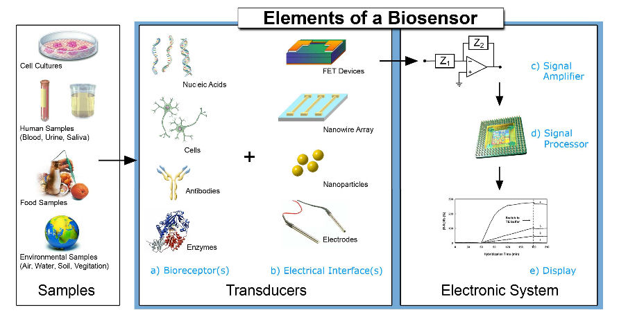

## Bridging the Gap:
### Synthetic Biology to Electronics
#### *Tentative Plan*
#### *August - December 2014*
### __Ryan Silva__

# Why?
- Biological sensors are good at detecting things that ECE sensors are not
- Output of sensors is cumbersome or expensive
	- Cumbersome - Arsenic Sensor visual pH color test
	- Expensive and Cumbersome - [Electrochemical Impedance
	  Spectroscopy](http://www.sciencedirect.com/science/article/pii/S0956566314002310)
		- Voltage sweep...not exactly field deployable (is this even
		  the goal?)

# The Idea
1. Biology $\unicode{10140}$ pH

2. pH $\unicode{10140}$ IBM Silicon NanoWire

3. IBM Silicon NanoWire $\unicode{10140}$ Voltage

4. Voltage $\unicode{10140}$ A/D

5. A/D $\unicode{10140}$ $\mu$C

6. $\mu$C $\unicode{10140}$ Display!

Courtesy [Dorothee Grieshaber](http://en.wikipedia.org/wiki/Biosensor)

## Formal Metrics
### Microcontroller

- Power
- Area
- Throughput
- Area Efficiency

## Formal Metrics
### Biology

- Metabolic Consumption
- Lifecycle of Cell

# Biology $\unicode{10140}$ pH
- Did we ever figure out where to get arsenic?
- Characterize pH curve 
	- Cliamed vs Experimental

## pH $\unicode{10140}$ IBM Silicon NanoWire
- How can I acquire a few of these devices??? 
	- Are they expensive?
	- How many can I get?
- Compare dynamic range of pH and nanowire input
- What can we do if they're not compatible?

## IBM Silicon NanoWire $\unicode{10140}$ Voltage
- Characterize voltage to pH curve
	- Cliamed vs Experimental

# Voltage $\unicode{10140}$ A/D
- Will we need a transducer interface?
	- If so, include design.

# A/D $\unicode{10140}$ $\mu$C
- What $\mu$C should we use?
- How do we want to display our output?

# $\mu$C $\unicode{10140}$ Display!
