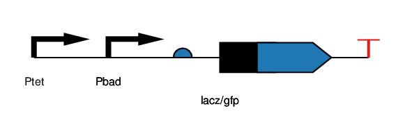
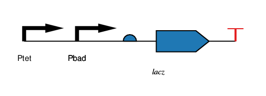
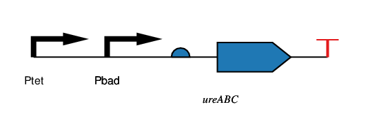

##Here's what I said last time:

###Where will TweeColi be in two weeks?
####New Components
- Wetlab
 - Flasks
 - Stir Plate
 - Stir Bars
- Probe Reconditioning Kit

###Where will TweeColi be in two weeks?
####New Capabilities
- Trigger tweet when pH reaches a threshold 
- Biological circuit ready to test?

##Here's where we actually are:

####New Components
- No new components

####New Capabilities
- SSH-able pH sensor interface in wetlab
- Three-point calibration of pH probe

##Here's where we're going:

###Design Meetings (Swapnil, Traci, Ryan)
#### 10 Oct and 17 Oct
- Tandem promoter pair (pTet-pBAD)

Design 1:

Design 2:

Design 3:

Design 4:

##Methodology Discussion
- Influenced heavily by the Tabor Lab
