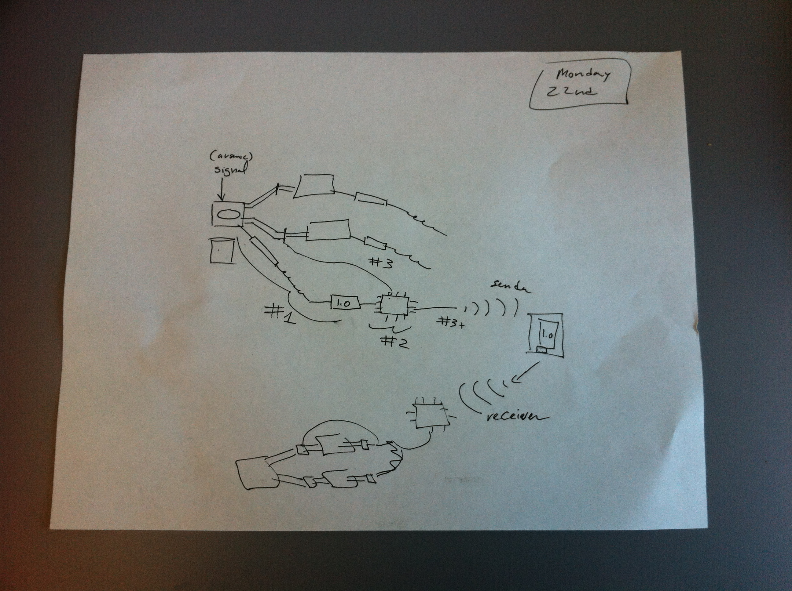
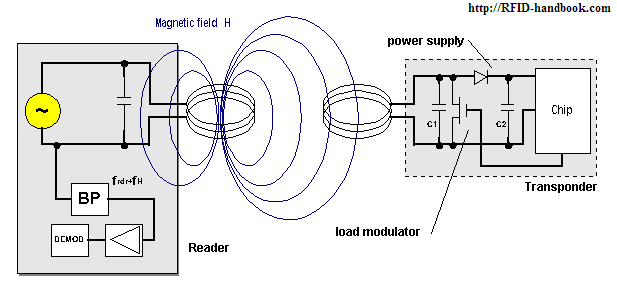
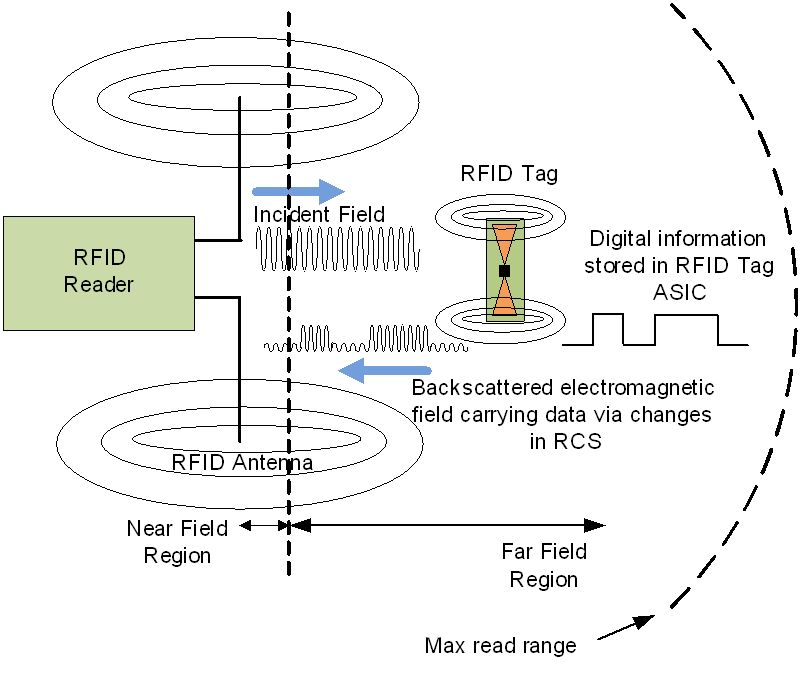
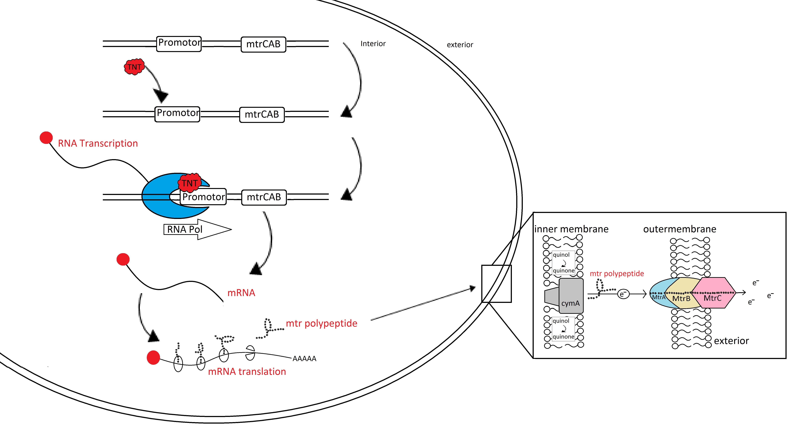

#3 Nov 2014

##TweeColi 2.0

##TweeColi 1.0
Jar

##TweeColi 2.0
RFID?

##Passive RFID System

##Passive RFID Signal

#17 Nov 2014

### CIDAR TweeColi vs TU Delft Electrace

| | TweeColi | Electrace |
| :--------- | -------------: | ----------------: |
| Sensing Mechanism | pH | Direct Electron Transport |
| Biological complexity | 1k basepairs | [>5k basepairs](http://parts.igem.org/Part:BBa_K1316012) |
| Electronic complexity | Higher | Lower |
| System complexity | ? | ? |

#The Process
- There are two processes classifications that we can consider for engineering bioelectronics:
 1. The Engineering Method
 2. Complex Systems Design
- How do we decide which to use?

## Does the system display *complexity*?
- [A system will be considered *complex* if it is **impossible** to predict all of its behaviors from the behaviors and relationships of its components](http://www.cvaieee.org/html/resp_citizen/Complex_Systems.pdf)

## What is a Complex System?
### Case study: Death Star

### Building Death Stars is a Bad Idea
- Operational and Programmatic difficulties 
  - [Defense Acquisitions University](http://www.dau.mil/pubscats/ATL%20Docs/Sep-Oct11/Ward.pdf) 

### Programmatic Assessment
- Cost
  - Overbudget
- Schedule
  - Multiple slips in critical path
  - "The Emperor is most displeased with your lack of progress" - [D.V.](http://www.starwars.com/video/vader-arrives-on-the-death-star)
- Performance

## Operational Assessment
- Poor combat performance
  - Main capability utilized only once
- Critical vulnerabilities
  - Effectively mitigated by half-trained Jedi
- Assessment: CAT 1A (Critically Flawed)

## Program Assessment: Death Star
- No Go
  - Overbudget
  - Behind Schedule
  - Blown up before Act II
  - Impossible to scale up production

### On-Time On-Budget Alternative
- Case Study: R2-D2

## Programmatic Assessment
- Simple requirements
  - No superfluous parts or unnecessary features
     - No language processor (beeps and squeaks)
     - No arms
     - No face
     - Small size 
- Simplistic design results in manageable cost/schedule

#Conclusion: 
##Build Artoos not Death Stars
###Bottom Line: Avoid _Complexity_

###Q: How do we know if our system is complex?
###A: Test it! 

##Test vs Experiment
- These are not the same!

##Experiment (Science)
- Prove a hypothesis
- Acceptable: Results can only be duplicated in a controlled environment

##Test (Engineering)
- Does the design meet the requirements?
  - Two phases: DT and OT

#Testing Phases
- Developmental Testing:
  - Does the system do what we think it should do in a controlled environment?
- Operational assessment: 
  - Does the design meet the requirements in the environment for which it was designed?

##TweeColi 1.0 DT
- Jar contains the most simple bioelectronics project our lab can build using the engineering method 
  - Based on a basic understanding of cellular behavior and chemistry, we have made a behavioral prediction
- If this works **reliably** then it may be acceptable to assume that our subsequent prototype can be designed using the Engineering Method
- If this doesn't work **reliably** then we may have to revisit our design methodology to either categorize our design domain as *complex* (avoid) or revisit our requirements

## How do we design systems if complexity cannot be avoided?
- Good question

## WARNING: Philosophical Overtones
- Reductionism is the basis for abstraction
- Reductionism is rendered FALSE in the face of [*emergent behaviors*](http://www.cvaieee.org/html/resp_citizen/Complex_Systems.pdf)
- What's an engineer or policy analyst to do?
 - Ex. GMO policy, gene drive research, climate change policy, etc

## Emphasize prediction and discovery first, then explanation
- Requires a scientist and an engineer
- Prediction: Design a system and a test with a boolean result (engineer)
- In case of failure, design an experiment for the discovery of emergent behaviors (scientist)
  - If emergent behaviors are found, explain them in terms of the properties of the system's components

### But what if our stuff doesn't work?
   1. Can we create a simpler genetic circuit?
   2. Should we just consider the system *complex*?
   3. Can we do something else?
