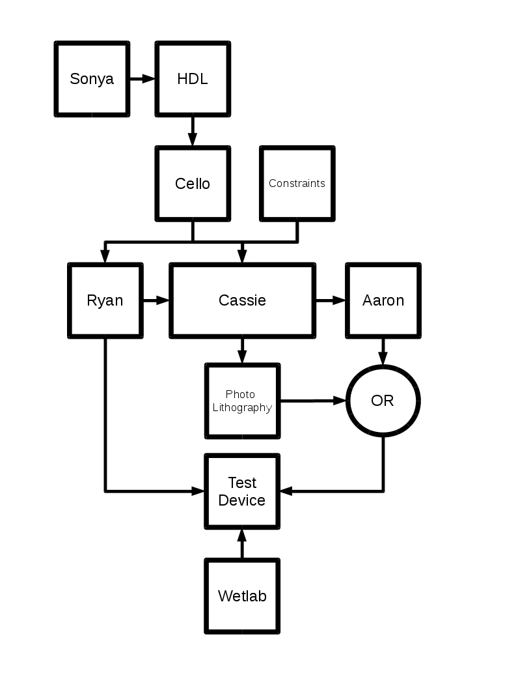

#3 Nov 2014

##TweeColi 2.0

##TweeColi 1.0
Jar

##TweeColi 2.0
RFID?

##Passive RFID System

##Passive RFID Signal

#17 Nov 2014

### CIDAR TweeColi vs TU Delft Electrace

| | TweeColi | Electrace |
| :--------- | -------------: | ----------------: |
| Sensing Mechanism | pH | Direct Electron Transport |
| Biological complexity | 1k basepairs | [>5k basepairs](http://parts.igem.org/Part:BBa_K1316012) |
| Electronic complexity | Higher | Lower |
| System complexity | ? | ? |

#Questions:
1. Have we determined if Biology is complex?
3. If not, we may be designing it wrong 
  - Are we using scientific experiments as engineering tests?
2. If so, are we designing it as such?

#The Process
- There are two processes classifications that we can consider for engineering bioelectronics:
 1. The Engineering Method
 2. Complex Systems Design
- How do we decide which to use?

## Does the system display *complexity*?
- [A system will be considered *complex* if it is **impossible** to predict all of its behaviors from the behaviors and relationships of its components](http://www.cvaieee.org/html/resp_citizen/Complex_Systems.pdf)

## What is a Complex System?
### Case study: Death Star

### Building Death Stars is a Bad Idea
- Operational and Programmatic difficulties 
  - [Defense Acquisitions University](http://www.dau.mil/pubscats/ATL%20Docs/Sep-Oct11/Ward.pdf) 

### Programmatic Assessment
- Cost
  - Overbudget
- Schedule
  - Multiple slips in critical path
  - "The Emperor is most displeased with your lack of progress" - [D.V.](http://www.starwars.com/video/vader-arrives-on-the-death-star)
- Performance

## Operational Assessment
- Poor combat performance
  - Main capability utilized only once
- Critical vulnerabilities
  - Effectively mitigated by half-trained Jedi
- Assessment: CAT 1A (Critically Flawed)

## Program Assessment: Death Star
- No Go
  - Overbudget
  - Behind Schedule
  - Blown up before Act II
  - Impossible to scale up production

### On-Time On-Budget Alternative
- Case Study: R2-D2

## Programmatic Assessment
- Simple requirements
  - No superfluous parts or unnecessary features
     - No language processor (beeps and squeaks)
     - No arms
     - No face
     - Small size 
- Simplistic design results in manageable cost/schedule

#Conclusion: 
##Build Artoos not Death Stars
###Bottom Line: Avoid _Complexity_

###Q: How do we know if our system is complex?
###A: Test it! 

##Test vs Experiment
- These are not the same!

##Experiment (Science)
- Accept/Reject a hypothesis. i.e. "Ask nature"
  - Recreate conditions under which an observation can be made
  - [Replicability is not Reproducibility](http://citeseerx.ist.psu.edu/viewdoc/summary?doi=10.1.1.149.5692) nor is it indicative of reliability
- Acceptable: Results can only be duplicated in a controlled environment

##Test (Engineering)
- Does the design meet the requirements reliably?
  - Two phases: DT and OT

#Testing Phases
- Developmental Testing:
  - Does the system do what we think it should do in a controlled environment?
- Operational assessment: 
  - Does the design meet the requirements in the environment for which it was designed?

##TweeColi 1.0 DT
- Jar contains the most simple bioelectronics project our lab can build using the engineering method 
  - Based on a basic understanding of cellular behavior and chemistry, we have made a behavioral prediction
- If this works **reliably** then it may be acceptable to assume that our subsequent prototype can be designed using the Engineering Method
- If this doesn't work **reliably** then we may have to revisit our design methodology to either categorize our design domain as *complex* (avoid) or revisit our requirements

## How do we design systems if complexity cannot be avoided?
- Good question

## WARNING: Philosophical Overtones
- Reductionism is the basis for abstraction
- Reductionism is rendered FALSE in the face of [*emergent behaviors*](http://www.cvaieee.org/html/resp_citizen/Complex_Systems.pdf)
- What's an engineer or policy analyst to do?
 - Ex. GMO policy, gene drive research, climate change policy, etc

## Emphasize prediction and discovery first, then explanation
- Requires a scientist and an engineer
- Prediction: Design a system and a test with a boolean result (engineer)
- In case of failure, design an experiment for the discovery of emergent behaviors (scientist)
  - If emergent behaviors are found, explain them in terms of the properties of the system's components

### But what if our stuff doesn't work?
   1. Can we create a simpler genetic circuit?
   2. Should we just consider the system *complex*?
   3. Can we do something else?

# 16 Dec 2014

###Bottom Line Up Front
- Demo report
- One-Two punch
  - Tech Contribution
  - Epistemic Contribution

###Demo Report
- Current TweeColi capabilities
  - Detect distributed biological events
  - Report events
  - Collect and interpret events
  - Perform logic using events as inputs
  - Actuate a response mechanism based on logic operation

###Tech Future
| Project | Timeline |
| :-: | :-: |
| Practical applications for TweeColi | Days |
| Biological GSM network using OpenBTS | Weeks to Months |
| Biological monitoring using RFID | Years | 

###Epistemic Contribution
- SynBio's Existential Crisis
- Importance of semantics
- Philosophy of Science **with data**

###SynBio's Existential Crisis
- It's been 14 years since the repressilator and switchable regulatory network
- What defines success in synbio?
  - Acquired knowledge?
  - Making things?
  - Solving problems?
- Cause vs Control
- Science vs Technoscience [[Nordmann 2014]](http://ryanjsilva.com/papers/Nordmann2014.pdf) vs Engineering 

###Semantics Are Important!
- Different processes
- Different goals
- Different design considerations
- Different ways of managing complexity
- Let's formally choose to abide by one (Engineering)

###Philosophy of Science
- Examines epistemic values
- Data is derived from publications in the field
- Information flows one way 
  - Field of research $\unicode{8594}$ Philosophy of Science

###Philosophy of Science...
###...With Experimental Data
- Let's complete the loop
  - Leverage their analyses to an actual design and document findings
  - Perhaps implement a method for complex design automation?
- No one is doing this
- Use a purely engineering approach to build a cool thing
- At least two contributions:
  - Document results as an engineering paper 
  - Document and comment on epistemic contributions as a Philosophy of Science paper 

### Nature 
> As it develops along this and other paths, synthetic biology itself will demand more by way of new fundamental biological knowledge — quantitative, systematic, computational and biophysical. And conversely, one of the deepest lessons from these first ten years is that **biological knowledge will require synthetic approaches** if it is to become a mature and reasonably predictive science. 

Nature editorial, 2010, "Ten years of synergy," _Nature_ 463, 269-270

###How did we get so confused?
- The quote was not "What I can create, I do understand"
- The quote was "What I cannot create, I do not understand" - Richard Feynman

### Problems 
- The bar for reporting may not be conducive to engineering 
  - In what sense is a repressilator an "experiment"?
  - Trying to satisfy both criteria 
    - Mostly science, with a few engineering terms sprinkled in
- Let's justify our position and then _**own**_ it
  - Maybe that will help restore the levels of scrutiny to levels appropriate with what we're trying to do
    - ENGINEER biology 

### How does this play into my current direction?
- Test modularity by working at the extreme ends of the design (I/O)
- Document findings

### Possible applications of TweeColi
- Automation of distributed irrational design testing
  - Three labs build a device that claims to have function X
  - Run TweeColi
  - Interpret results at processing node 

###Engineering complex systems 
- How to design with complexity in mind
- Must decide which engineering design technique to eliminate
 - Modularity
 - Regularity
 - Hierarchy
 - Discipline
 - Abstraction
- Begin by analyzing how the system was initially designed
 - Case study: x86 architecture
 - Very tricky (and not without controversy) for Biology

### Philosophy of Science and SynBio
- Example articles
- Seem focused on balance of knowledge and power
- Leverage their analyses to an actual design and document findings
  - Perhaps implement a method for complex design automation
- Eliminate the need for modularity [Lewens 2013](http://ryanjsilva.com/papers/Lewens2013.pdf)

### Philosophy of Science and SynBio
### WITH DATA!
- No one is doing this
- Example: In meteorology, if the model incorrectly predicts a certain type of weather what do we do? 
  - Do we throw out the model? 
  - Search for a new model? 
  - Or do we accept, for the time being, that the current model is "good" but has finite resolution and reliability 
    - Cold vs 30 degF 
    - Bring an umbrella just in case vs two inches of precipitation at 11am tomorrow
  - Are we using the model to learn about the atmosphere?
  - Or are we using it to help us better live our lives?

### Semantics are Important!
- Let's try to stop semantical "hand waving" 
  - Systems Biology vs Synthetic Biology
  - Engineering vs Science vs Technoscience
  - Basic vs Applied Science
  - Cause vs Control
- Let's not confuse managing complexity with engineering!
  - It is possible to "properly" engineer a system that is not modular, hierarchical, etc

# 13 Jan 2015

### Individual Interests
- If I woke up tomorrow and my system worked perfectly, what would it look like and what would it do?

<iframe width="420" height="315" src="//www.youtube.com/embed/23zN8FhjPns" frameborder="0" allowfullscreen></iframe>

<iframe width="420" height="315" src="//www.youtube.com/embed/tO1KJDOfeHE" frameborder="0" allowfullscreen></iframe>

## Topology
- Star Topology

## System Requirements
- Detect real-world changes in pH from physically separated input nodes
- Detection ranges must be modifiable 
- Input nodes must transmit a notification via the internet of the change in pH
- The output and processing node must detect and interpret the change in pH from the input nodes.
- The output node must perform a logical operation on the interpreted pH readings from the input nodes

### Output Node
- Collect and interpret events
- Perform logic using events as inputs
- Actuate a response mechanism based on logic operation
- Successfully tested for the following parameters:
  - N=2
  - XOR operation in FPGA
  - LED as the output mechanism

### Input Node
- Detect distributed biological events
- Modifiable detection ranges
- Transmit a notification via the internet of biological anomaly 

### Input Node Initialization
1. Input chemical name for which the node will sense
2. Input upper and lower steady-state pH bounds 
  - i.e. pH bounds for no chemical present
3. Input Twitter account to which the system will post results 

### Input Node Operation
- pH transition outside of operating range:
  - Post single Twitter feed update in the form of: _chemical True timestamp_ 
  - chemical can be aTc, Ara, etc.
- pH returns to value within operating range:
  - Post single Twitter feed update in the form of:_chemical False timestamp_

### Demo

### Current Capabilities
- Detect distributed biological events
- Report events
- Collect and interpret events
- Perform logic using events as inputs
- Actuate a response mechanism based on logic operation

### Equipment Acquired during the Break
- 25 Xilinx Vivado/ISE System Edition Licenses
- Xilinx Partial Reconfiguration License
- 2x Digilent Basys3 FPGA Development Boards
- 1x Digilent ZedBoard
- 1x Ettus Research E310 USRP

### Semester Goals
- Add the following capabilities:
  - FPGA Partial Reconfiguration
  - 3D print a custom chassis 
  - Killer application for FPGA + RPi
- Recreate the Voigt experiment
- Create a system that does either:
  1. Automation of distributed design verification 
  2. [Environmental Diagnostics in Austere Environs](http://www.oxcaht.org/)

### Distributed Design Verification 
- Three labs build a device that claims to have function X
- Run TweeColi
- Interpret results at processing node 

### Environmental Diagnostics in Austere Environs
- Problem = Limited Resources
  - Power
  - Accessibility
  - Harsh conditions
- Bioelectronics
  - Low power
  - [Small, disposable, survivable sensors](http://arsenicbiosensor.org/index.html)
  - Ubiquitous computing platform
    - Mobile phone!

#9 Feb 2015

## Electronics Design Flow
1. Specify computing hardware
  - RPi, Arduino, PC, FPGA
    - Each device implies constraints
2. Specify computational features
  - Sensors
    - pH, DOx, Color, lx, etc
  - Control (Possibly driven by Fluigi) 
    - Valve, Assay, etc
  - Decisions
    - Feedback

## FPGA $\mu$F Suite
- Partial Reconfiguration
- GPIO-limited Parallel Sensors
  - Significant advantage over other computational platforms
    - Sensor interfaces limited by PHY devices
    - Even the Arduino's SotwareSerial Library has many [hardware limitations](http://arduino.cc/en/Reference/SoftwareSerial)
  - Drivers for UART, I2C, SPI, Direct IO
- Hardware acceleration modules

### Initial Experiment

## Notes from meeting
- What we need:
  - Sonya's big picture
  - FluigiWorld (refined flow)
    - Refine functionality bullets for each part of Fluigi
    - No one should change the flow without a group meeting 
  - Each person's revisions
    - Goals (checkbox of dates of completions)
    - Integration paths
  - Come up with a name for our parts
  - User perspectives
    - End user
    - BioE user
    - 3D user
    - Wetlab user
  - Ryan will send the flow made pretty
  - Ryan will send a "shrunk-down squares" version of flow

# 9 March 2015

- Fluigi Primitives
  - Ports
  - Channels
  - Valves (3D)
  - Valves (lith)
  - Cell Trap
  - Mixer
  - Rotary Mixer
  - Sensing chamber

[PowerPoint Link](fluigi_flow.odp)

# 4 May 2015

| Task | Status | Updated |
| :-- | :-: | :-: |
| Electronic Sensor List | $\unicode{128161}$ |$\unicode{9745}$ |
| Electronic Actuator List | $\unicode{128161}$ |$\unicode{9745}$ |
| Electronic Hardware List | $\unicode{128036}$ |$\unicode{9745}$ |
| Flow Diagram | $\unicode{9745}$ |$\unicode{9745}$ |
| pH Sensing Update | $\unicode{9745}$ |$\unicode{9745}$ |
| Twitter Integration | $\unicode{9745}$ |$\unicode{9745}$ |
| FPGA HW Utilization Details | $\unicode{9744}$ |$\unicode{9745}$ |

| Task | Status | Updated |
| :-- | :-: | :-: |
| Channel Chomp Website | $\unicode{9744}$ |$\unicode{9745}$ |
| FluigiCAD Design Wizard Mockup | $\unicode{9744}$ |$\unicode{9745}$ |
| Status of Wetlab Experiments | $\unicode{9745}$ |$\unicode{9745}$ |
| Modular Electronic Chassis Design | $\unicode{9744}$ |$\unicode{9745}$ |
| Summary of 18 March Office Meeting | $\unicode{9745}$ |$\unicode{9745}$ |
| List of Graduation Requirements | $\unicode{9744}$ |$\unicode{9745}$ |
| RPC Qual Details | $\unicode{9745}$ |$\unicode{9745}$ |
| Air Force Staff Meeting Demo | $\unicode{9745}$ |$\unicode{9745}$ |

### Sensor List

| Sensor | Demo  | Module in Library |
| :-: | :-: | :-: |
| pH | $\unicode{9744}$$\unicode{9744}$$\unicode{9745}$$\unicode{9745}$ | $\unicode{9744}$$\unicode{9744}$$\unicode{9745}$$\unicode{9744}$|
| Color | $\unicode{9745}$$\unicode{9744}$$\unicode{9744}$$\unicode{9744}$ | $\unicode{9744}$$\unicode{9744}$$\unicode{9744}$$\unicode{9744}$ |
| LUX | $\unicode{9744}$$\unicode{9744}$$\unicode{9744}$$\unicode{9744}$ | $\unicode{9744}$$\unicode{9744}$$\unicode{9744}$$\unicode{9744}$ |
| Fluorescence | $\unicode{9744}$$\unicode{9744}$$\unicode{9744}$$\unicode{9744}$ | $\unicode{9744}$$\unicode{9744}$$\unicode{9744}$$\unicode{9744}$ |
| DOX | $\unicode{9744}$$\unicode{9744}$$\unicode{9744}$$\unicode{9744}$ | $\unicode{9744}$$\unicode{9744}$$\unicode{9744}$$\unicode{9744}$ |
| Pressure | $\unicode{9744}$$\unicode{9744}$$\unicode{9744}$$\unicode{9744}$ |  $\unicode{9744}$$\unicode{9744}$$\unicode{9744}$$\unicode{9744}$ |
| Conductivity |  $\unicode{9744}$$\unicode{9744}$$\unicode{9744}$$\unicode{9744}$ |  $\unicode{9744}$$\unicode{9744}$$\unicode{9744}$$\unicode{9744}$ |
| Temperature |  $\unicode{9744}$$\unicode{9744}$$\unicode{9744}$$\unicode{9744}$ |  $\unicode{9744}$$\unicode{9744}$$\unicode{9744}$$\unicode{9744}$ |
| ORP | $\unicode{9744}$$\unicode{9744}$$\unicode{9744}$$\unicode{9744}$ |  $\unicode{9744}$$\unicode{9744}$$\unicode{9744}$$\unicode{9744}$ |
| Flow |  $\unicode{9744}$$\unicode{9744}$$\unicode{9744}$$\unicode{9744}$ |  $\unicode{9744}$$\unicode{9744}$$\unicode{9744}$$\unicode{9744}$ |

(FPGA, $\mu$C, RPI, PC)

# Actuator List 
| Device | Demo  | SCAD Files | Control Software | 
| :---: | :---: | :---: | :---: |
| Klavins Syringe Pump | $\unicode{9744}$$\unicode{9745}$$\unicode{9744}$$\unicode{9744}$ | $\unicode{9744}$$\unicode{9744}$$\unicode{9744}$$\unicode{9744}$|$\unicode{9744}$$\unicode{9744}$$\unicode{9744}$$\unicode{9744}$|
| MIT Syringe Pump | $\unicode{9744}$$\unicode{9744}$$\unicode{9744}$$\unicode{9744}$ | $\unicode{9744}$$\unicode{9744}$$\unicode{9744}$$\unicode{9744}$ |$\unicode{9744}$$\unicode{9744}$$\unicode{9744}$$\unicode{9744}$|
| Open Syringe Pump | $\unicode{9744}$$\unicode{9744}$$\unicode{9744}$$\unicode{9744}$ | $\unicode{9744}$$\unicode{9744}$$\unicode{9744}$$\unicode{9744}$ |$\unicode{9744}$$\unicode{9744}$$\unicode{9744}$$\unicode{9744}$|

(FPGA, $\mu$C, RPI, PC)

###Electronic Hardware List
| Device | Acquired | Price |
| :---: | :---: | 
| PC | $\unicode{9745}$ | |
| Arduino MEGA | $\unicode{9745}$ ||
| MSP430 | $\unicode{9745}$ ||
| Basys3 FPGA | $\unicode{9745}$ ||
| NEMA 11 Motor | $\unicode{9745}$ | |
| NEMA 17 Motor | $\unicode{9745}$ | |
| HiTEC 645MG Servo | $\unicode{9745}$ ||
| Atlas Serial Debugger | $\unicode{9745}$ ||
| Atlas pH Stamp | $\unicode{9745}$ ||

##Electronic Hardware List (cntd)
| Device | Acquired | Price |
| :---: | :---: | 
| Atlas DOX Stamp | $\unicode{9745}$ ||
| Atlas Conductivity Stamp | $\unicode{9744}$ |$52|
| Atlas ORP Stamp | $\unicode{9744}$ |$34|
| Atlas Temp Probe | $\unicode{9744}$ |$22|
| Atlas RGB/LUX Probe | $\unicode{9745}$ ||
| Atlas Flow Stamp | $\unicode{9744}$ |$34|
| DC ppv Flow Meter | $\unicode{9744}$ |$??|
| Atlas Pressure Sensor | $\unicode{9744}$ |$350\*|

###Channel Chomp Flow

##Voigt XOR

##pH Sensing Goal (Input)

From 17 November 2014 Meeting

##pH Sensing Goal (Output)

From 17 November 2014 Meeting

##pH Sensing Goal (New Output)

##Overall Experiment 

##pH Sensing Update

| Test | Hypothesis | Status | Projection |
| :-: | :-: | :-: | :-: | :-:|
| Cleaning protocol using reconditioning solution | Solution will kill bacteria | 2x Unsuccessful tests | Reject hypothesis |
| Cleaning protocol using bleach | Bleach will kill bacteria | 6x Successful tests | Accept hypothesis |
| DVL1 | pH $\unicode{8733}$ $c(Lactose)^{-1}$ | 1x Successful test | Accept hypothesis | 
| pConst-LacZ | pH $\unicode{8733}$ $c(Lactose)^{-1}$ | 1x Successful Test with strong promoter | Accept Hypothesis | 

## pH Sensing Update (Continued)
| Test | Hypothesis | Status | Projection |
| :-: | :-: | :-: | :-: | :-:|
| pR10LacZ (Modular Version of DVL1) | pH $\unicode{8733}$ $c(Lactose)^{-1}$ | 2x Successful Tests | Accept Hypothesis | 
| pBad - LacZ (pBADLacZ:J024mAraC) | pH$\unicode{8595}$ inducible by Ara | Cloning complete by 5/7 | Test by 5/8 |
| pTet - LacZ (pTetLacZ:J024mTetR) | pH$\unicode{8595}$ inducible by aTc | Cloning complete by 5/7 | Test by 5/8 | 
| pRhl - YFP | Express YFP induced by RhlI | Voigt plasmids plated in wetlab | Test when sequence verified  |

##Twitter Integration Status

- Both Input and Output integration has been publicly demonstrated

##FPGA Integration

##Channel Chomp Website
- No Progress

##FluigiCAD Design Wizard Mockup
- No Progress

##Chassis Design
- No Progress

##Office Meeting Summary
- Essence captured in this presentation

##Graduation Requirements
- All boxes checked?

##Qual Details
- 15 May
- Committee:
  - Joshi
  - Karpovsky
  - Cassandras

# 18 May 2015

| Task | Status | Updated |
| :-- | :-: | :-: |
| Electronic Sensor List | $\unicode{128161}$ |$\unicode{9989}$ |
| Electronic Actuator List | $\unicode{128161}$ |$\unicode{9989}$ |
| Electronic Hardware List | $\unicode{128161}$ |$\unicode{9989}$ |
| Flow Diagram | $\unicode{9989}$ |$\unicode{9940}$ |
| pH Sensing Update | $\unicode{128161}$ |$\unicode{9989}$ |
| Twitter Integration | $\unicode{9989}$ |$\unicode{9940}$ |
| FPGA HW Utilization Details | $\unicode{9989}$ |$\unicode{9940}$ |

| Task | Status | Updated |
| :-- | :-: | :-: |
| Channel Chomp Website | $\unicode{9940}$ |$\unicode{9940}$ |
| FluigiCAD Design Wizard Mockup | $\unicode{9940}$ |$\unicode{9940}$ |
| Status of Wetlab Experiments | $\unicode{128161}$ |$\unicode{9989}$ |
| Modular Electronic Chassis Design | $\unicode{128161}$ |$\unicode{9989}$ |
| Summary of 18 March Office Meeting | $\unicode{9989}$ |$\unicode{9940}$ |
| List of Graduation Requirements | $\unicode{128161}$ |$\unicode{9940}$ |
| RPC Qual Details | $\unicode{9989}$ |$\unicode{9940}$ |
| Air Force Staff Meeting Demo | $\unicode{9989}$ |$\unicode{9940}$ |

### Sensor List

| Sensor | Demo  | Module in Library |
| :-: | :-: | :-: |
| pH | $\unicode{9940}$$\unicode{9940}$$\unicode{9989}$$\unicode{9989}$ | $\unicode{9940}$$\unicode{9940}$$\unicode{9989}$$\unicode{128161}$|
| Color | $\unicode{128161}$$\unicode{128161}$$\unicode{128161}$$\unicode{128161}$ | $\unicode{9940}$$\unicode{9940}$$\unicode{9940}$$\unicode{9940}$ |
| LUX | $\unicode{9940}$$\unicode{9940}$$\unicode{9940}$$\unicode{9940}$ | $\unicode{9940}$$\unicode{9940}$$\unicode{9940}$$\unicode{9940}$ |
| Fluorescence | $\unicode{9940}$$\unicode{9940}$$\unicode{9940}$$\unicode{9940}$ | $\unicode{9940}$$\unicode{9940}$$\unicode{9940}$$\unicode{9940}$ |
| DOX | $\unicode{9940}$$\unicode{9940}$$\unicode{9940}$$\unicode{9940}$ | $\unicode{9940}$$\unicode{9940}$$\unicode{9940}$$\unicode{9940}$ |
| Pressure | $\unicode{9940}$$\unicode{9940}$$\unicode{9940}$$\unicode{9940}$ |  $\unicode{9940}$$\unicode{9940}$$\unicode{9940}$$\unicode{9940}$ |
| Conductivity |  $\unicode{9940}$$\unicode{9940}$$\unicode{9940}$$\unicode{9940}$ |  $\unicode{9940}$$\unicode{9940}$$\unicode{9940}$$\unicode{9940}$ |
| Temperature |  $\unicode{9940}$$\unicode{9940}$$\unicode{9940}$$\unicode{9940}$ |  $\unicode{9940}$$\unicode{9940}$$\unicode{9940}$$\unicode{9940}$ |
| ORP | $\unicode{9940}$$\unicode{9940}$$\unicode{9940}$$\unicode{9940}$ |  $\unicode{9940}$$\unicode{9940}$$\unicode{9940}$$\unicode{9940}$ |
| Flow |  $\unicode{9940}$$\unicode{9940}$$\unicode{9940}$$\unicode{9940}$ |  $\unicode{9940}$$\unicode{9940}$$\unicode{9940}$$\unicode{9940}$ |

(FPGA, $\mu$C, RPI, PC)

# Actuator List 
| Device | Demo  | SCAD Files | Control Software | 
| :---: | :---: | :---: | :---: |
| Klavins Syringe Pump | $\unicode{9940}$$\unicode{9989}$$\unicode{9940}$$\unicode{9940}$ | $\unicode{9940}$$\unicode{9940}$$\unicode{9940}$$\unicode{9940}$|$\unicode{9940}$$\unicode{9940}$$\unicode{9940}$$\unicode{9940}$|
| MIT Syringe Pump | $\unicode{9940}$$\unicode{128161}$$\unicode{9940}$$\unicode{9940}$ | $\unicode{9940}$$\unicode{9940}$$\unicode{9940}$$\unicode{9940}$ |$\unicode{9940}$$\unicode{9940}$$\unicode{9940}$$\unicode{9940}$|
| Open Syringe Pump | $\unicode{9940}$$\unicode{9940}$$\unicode{9940}$$\unicode{9940}$ | $\unicode{9940}$$\unicode{9940}$$\unicode{9940}$$\unicode{9940}$ |$\unicode{9940}$$\unicode{9940}$$\unicode{9940}$$\unicode{9940}$|

(FPGA, $\mu$C, RPI, PC)

###Electronic Hardware List
| Device | Acquired | Price |
| :---: | :---: | 
| PC | $\unicode{9989}$ | $?? |
| Arduino MEGA | $\unicode{9989}$ | $45 |
| MSP430 | $\unicode{9989}$ | $10 |
| Basys3 FPGA | $\unicode{9989}$ | $75 |
| NEMA 11 Motor | $\unicode{9989}$ | $15 |
| NEMA 17 Motor | $\unicode{9989}$ | $18 |
| HiTEC 645MG Servo | $\unicode{9989}$ | $25 |
| Atlas Serial Debugger | $\unicode{9989}$ |$18|
| Atlas pH Stamp | $\unicode{9989}$ |$34|

##Electronic Hardware List (cntd)
| Device | Acquired | Price |
| :---: | :---: | 
| Atlas DOX Stamp | $\unicode{9989}$ | $40|
| Atlas Conductivity Stamp | $\unicode{9940}$ |$52|
| Atlas pH Probe | $\unicode{9989}$ |$72|
| Atlas ORP Stamp | $\unicode{9940}$ |$34|
| Atlas Temp Probe | $\unicode{9940}$ |$22|
| Atlas RGB/LUX Probe | $\unicode{9989}$ |$48|
| Atlas Flow Stamp | $\unicode{9940}$ |$34|
| DC ppv Flow Meter | $\unicode{9940}$ |$??|
| Atlas Pressure Sensor | $\unicode{9940}$ |$350\*|

###Channel Chomp Flow

##Voigt XOR

##pH Sensing Goal (Input)

From 17 November 2014 Meeting

##pH Sensing Goal (Output)

From 17 November 2014 Meeting

##pH Sensing Goal (New Output)

##Overall Experiment 

##pH Sensing Update

| Test | Hypothesis | Status | Projection |
| :-: | :-: | :-: | :-: | :-:|
| Cleaning protocol using reconditioning solution | Solution will kill bacteria | 2x Unsuccessful tests | Reject hypothesis |
| Cleaning protocol using bleach | Bleach will kill bacteria | 6x Successful tests | Accept hypothesis |
| DVL1 | pH $\unicode{8733}$ $c(Lactose)^{-1}$ | 1x Successful test | Accept hypothesis | 
| pConst-LacZ | pH $\unicode{8733}$ $c(Lactose)^{-1}$ | 1x Successful Test with strong promoter | Accept Hypothesis | 

## pH Sensing Update (Continued)
| Test | Hypothesis | Status | Projection |
| :-: | :-: | :-: | :-: | :-:|
| pR10LacZ (Modular Version of DVL1) | pH $\unicode{8733}$ $c(Lactose)^{-1}$ | 2x Successful Tests | Accept Hypothesis | 
| pBad - LacZ (pBADLacZ:J024mAraC) | pH$\unicode{8595}$ inducible by Ara | Cloning complete by 5/7 | Test by 5/8 |
| pTet - LacZ (pTetLacZ:J024mTetR) | pH$\unicode{8595}$ inducible by aTc | Cloning complete by 5/7 | Test by 5/8 | 
| pRhl - YFP | Express YFP induced by RhlI | Voigt plasmids plated in wetlab | Test when sequence verified  |

##Chassis Design
- Syringe Pump Chassis 

# 1 June 2015

| Task | Status | Updated |
| :-- | :-: | :-: |
| Requisition Summary | $\unicode{9989}$ | $\unicode{9989}$|
| Electronic Sensor List | $\unicode{128161}$ |$\unicode{9989}$ |
| Electronic Actuator List | $\unicode{128161}$ |$\unicode{9989}$ |
| pH Sensing Update | $\unicode{128161}$ |$\unicode{9989}$ |
| Status of Wetlab Experiments | $\unicode{128161}$ |$\unicode{9989}$ |

| Task | Status | Updated |
| :-- | :-: | :-: |
| Flow Diagram | $\unicode{9989}$ |$\unicode{9940}$ |
| Twitter Integration | $\unicode{9989}$ |$\unicode{9940}$ |
| FPGA HW Utilization Details | $\unicode{9989}$ |$\unicode{9940}$ |
| RPC Qual Details | $\unicode{9989}$ |$\unicode{9940}$ |
| Summary of 18 March Office Meeting | $\unicode{9989}$ |$\unicode{9940}$ |
| Air Force Staff Meeting Demo | $\unicode{9989}$ |$\unicode{9940}$ |
| Electronic Hardware List | $\unicode{128161}$ |$\unicode{9940}$ |
| Modular Electronic Chassis Design | $\unicode{128161}$ |$\unicode{9940}$ |
| List of Graduation Requirements | $\unicode{128161}$ |$\unicode{9940}$ |
| Channel Chomp Website | $\unicode{9940}$ |$\unicode{9940}$ |
| FluigiCAD Design Wizard Mockup | $\unicode{9940}$ |$\unicode{9940}$ |

### Requisition Summary

[link to google doc](https://docs.google.com/spreadsheets/d/1X3tJJIS7qwcB0Jbxkm4pJE9CA4kKhgeU56RBTPd8e1A/edit?usp=sharing)

### Hardware Agnostic Fluid Monitoring and Control
- [Spa Sitter](http://hackaday.com/2015/06/01/poolhot-tub-monitoring-and-data-collection/)
  - $\mu$C
- [Aquarimeter](https://github.com/aquarimeter/aquarimeter)
  - RPi
- [OpenHydroponics](https://github.com/evandavey/OpenHydroponics)
  - PC/$\mu$C

### Sensor List

| Sensor | Demo  | Module in Library |
| :-: | :-: | :-: |
| pH | $\unicode{9940}$$\unicode{9940}$$\unicode{9989}$$\unicode{9989}$ | $\unicode{9940}$$\unicode{9940}$$\unicode{9989}$$\unicode{128161}$|
| Color | $\unicode{128161}$$\unicode{128161}$$\unicode{128161}$$\unicode{9989}$ | $\unicode{9940}$$\unicode{9940}$$\unicode{9940}$$\unicode{128161}$ |
| LUX | $\unicode{9940}$$\unicode{9940}$$\unicode{9940}$$\unicode{9940}$ | $\unicode{9940}$$\unicode{9940}$$\unicode{9940}$$\unicode{9940}$ |
| Fluorescence | $\unicode{9940}$$\unicode{9940}$$\unicode{9940}$$\unicode{9940}$ | $\unicode{9940}$$\unicode{9940}$$\unicode{9940}$$\unicode{9940}$ |
| DOX | $\unicode{9940}$$\unicode{9940}$$\unicode{9940}$$\unicode{9940}$ | $\unicode{9940}$$\unicode{9940}$$\unicode{9940}$$\unicode{9940}$ |
| Pressure | $\unicode{9940}$$\unicode{9940}$$\unicode{9940}$$\unicode{9940}$ |  $\unicode{9940}$$\unicode{9940}$$\unicode{9940}$$\unicode{9940}$ |
| Conductivity |  $\unicode{9940}$$\unicode{9940}$$\unicode{9940}$$\unicode{9940}$ |  $\unicode{9940}$$\unicode{9940}$$\unicode{9940}$$\unicode{9940}$ |
| Temperature |  $\unicode{9940}$$\unicode{9940}$$\unicode{9940}$$\unicode{9940}$ |  $\unicode{9940}$$\unicode{9940}$$\unicode{9940}$$\unicode{9940}$ |
| ORP | $\unicode{9940}$$\unicode{9940}$$\unicode{9940}$$\unicode{9940}$ |  $\unicode{9940}$$\unicode{9940}$$\unicode{9940}$$\unicode{9940}$ |
| Flow |  $\unicode{9940}$$\unicode{9940}$$\unicode{9940}$$\unicode{9940}$ |  $\unicode{9940}$$\unicode{9940}$$\unicode{9940}$$\unicode{9940}$ |

(FPGA, $\mu$C, RPI, PC)

# Actuator List 
| Device | Demo  | SCAD Files | Control Software | 
| :---: | :---: | :---: | :---: |
| Klavins Syringe Pump | $\unicode{9940}$$\unicode{9989}$$\unicode{9940}$$\unicode{9940}$ | $\unicode{9940}$$\unicode{9940}$$\unicode{9940}$$\unicode{9940}$|$\unicode{9940}$$\unicode{9940}$$\unicode{9940}$$\unicode{9940}$|
| MIT Syringe Pump | $\unicode{9940}$$\unicode{128161}$$\unicode{128161}$$\unicode{9940}$ | $\unicode{9940}$$\unicode{128161}$$\unicode{128161}$$\unicode{9940}$ |$\unicode{9940}$$\unicode{128161}$$\unicode{128161}$$\unicode{9940}$|
| Open Syringe Pump | $\unicode{9940}$$\unicode{128161}$$\unicode{128161}$$\unicode{9940}$ | $\unicode{9940}$$\unicode{128161}$$\unicode{128161}$$\unicode{9940}$ |$\unicode{9940}$$\unicode{128161}$$\unicode{128161}$$\unicode{9940}$|

(FPGA, $\mu$C, RPI, PC)

##pH Sensing Goal (Input)

From 17 November 2014 Meeting

##pH Sensing Goal (Output)

##Overall Experiment 

# 15 June 2015

| Task | Status | Updated |
| :-- | :-: | :-: |
| Electronic Actuator List | $\unicode{128161}$ |$\unicode{9989}$ |
| pH Sensing Update | $\unicode{128161}$ |$\unicode{9989}$ |
| Status of Wetlab Experiments | $\unicode{128161}$ |$\unicode{9989}$ |
| Channel Chomp Software/Website | $\unicode{128161}$ |$\unicode{9989}$ |

| Task | Status | Updated |
| :-- | :-: | :-: |
| Electronic Sensor List | $\unicode{128161}$ |$\unicode{9940}$ |
| Requisition Summary | $\unicode{9989}$ | $\unicode{9940}$|
| Flow Diagram | $\unicode{9989}$ |$\unicode{9940}$ |
| Twitter Integration | $\unicode{9989}$ |$\unicode{9940}$ |
| FPGA HW Utilization Details | $\unicode{9989}$ |$\unicode{9940}$ |
| RPC Qual Details | $\unicode{9989}$ |$\unicode{9940}$ |
| Summary of 18 March Office Meeting | $\unicode{9989}$ |$\unicode{9940}$ |
| Air Force Staff Meeting Demo | $\unicode{9989}$ |$\unicode{9940}$ |
| Electronic Hardware List | $\unicode{128161}$ |$\unicode{9940}$ |
| Modular Electronic Chassis Design | $\unicode{128161}$ |$\unicode{9940}$ |
| List of Graduation Requirements | $\unicode{128161}$ |$\unicode{9940}$ |
| FluigiCAD Design Wizard Mockup | $\unicode{9940}$ |$\unicode{9940}$ |

# Control Software
- Concurrency
- Accuracy
- Precision
- Control

# The competition
<iframe width="560" height="315" src="https://www.youtube.com/embed/Fatt2Mw1GPc" frameborder="0" allowfullscreen></iframe>

# Experiment

# Valves

# Actuator List 
| Device | Demo  | SCAD Files | Control Software | 
| :---: | :---: | :---: | :---: |
| Klavins Syringe Pump | $\unicode{9940}$$\unicode{9989}$$\unicode{9940}$$\unicode{9940}$ | $\unicode{9940}$$\unicode{9940}$$\unicode{9940}$$\unicode{9940}$|$\unicode{9940}$$\unicode{9940}$$\unicode{9940}$$\unicode{9940}$|
| MIT Syringe Pump | $\unicode{9940}$$\unicode{128161}$$\unicode{128161}$$\unicode{9940}$ | $\unicode{9940}$$\unicode{128161}$$\unicode{128161}$$\unicode{9940}$ |$\unicode{9940}$$\unicode{128161}$$\unicode{128161}$$\unicode{9940}$|
| Open Syringe Pump | $\unicode{9940}$$\unicode{128161}$$\unicode{128161}$$\unicode{9940}$ | $\unicode{9940}$$\unicode{128161}$$\unicode{128161}$$\unicode{9940}$ |$\unicode{9940}$$\unicode{128161}$$\unicode{128161}$$\unicode{9940}$|

(FPGA, $\mu$C, RPI, PC)

#TweeColi Paper 
- Intellectual Contributions
  - Division of labor
  - Managing complexity
- Scientific Contributions
  - Modular pH reporting

#TweeColi Paper Structure
- Intro
  - Highlight contributions
- Experiment
- Results
- Implications

##pH Sensing Goal (Input)

From 17 November 2014 Meeting

##pH Sensing Goal (Output)

##Overall Experiment 

